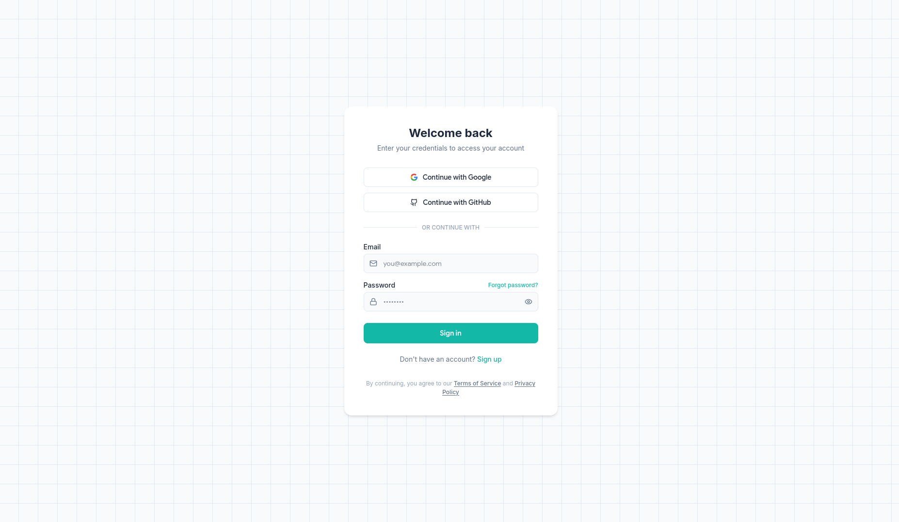

# Auth Frontend

<div align="center">
  
  
  <p align="center">
    A modern, responsive authentication interface built with React.
    <br />
    <a href="#getting-started"><strong>Explore the docs »</strong></a>
    <br />
    <br />
    <a href="#features">View Demo</a>
    ·
    <a href="#issues">Report Bug</a>
    ·
    <a href="#issues">Request Feature</a>
  </p>
</div>

## 📋 About The Project

This project is a sleek, modern frontend for an authentication system. It provides a user-friendly interface for logging in, featuring social authentication options and a clean design. It is designed to connect seamlessly with a backend API (e.g., FastAPI).

### ✨ Features

*   **Modern UI/UX**: Clean, card-based layout with a subtle grid background.
*   **Responsive Design**: Fully responsive and mobile-friendly.
*   **Social Login UI**: Buttons for Google and GitHub authentication.
*   **Secure Input**: Password field with show/hide functionality.
*   **Interactive Elements**: Hover states and focus effects for better user experience.
*   **Iconography**: Uses `lucide-react` for consistent and beautiful icons.

## 🛠️ Built With

*   [![React][React.js]][React-url]
*   [![CSS3][CSS3]][CSS3-url]
*   **Lucide React** - For icons.

## 🚀 Getting Started

To get a local copy up and running, follow these simple steps.

### Prerequisites

*   npm
    ```sh
    npm install npm@latest -g
    ```

### Installation

1.  Clone the repo
    ```sh
    git clone https://github.com/sanjayrohith/Auth-Frontend.git
    ```
2.  Navigate to the project directory
    ```sh
    cd Auth-Frontend
    ```
3.  Install NPM packages
    ```sh
    npm install
    ```
4.  Start the development server
    ```sh
    npm start
    ```

## 🔌 Backend Integration

This frontend is configured to send `POST` requests to `http://127.0.0.1:8000/login`. Ensure your backend server is running and accessible at this endpoint.

The payload structure for login is:
```json
{
  "email": "user@example.com",
  "password": "yourpassword"
}
```

## 🤝 Contributing

Contributions are what make the open source community such an amazing place to learn, inspire, and create. Any contributions you make are **greatly appreciated**.

1.  Fork the Project
2.  Create your Feature Branch (`git checkout -b feature/AmazingFeature`)
3.  Commit your Changes (`git commit -m 'Add some AmazingFeature'`)
4.  Push to the Branch (`git push origin feature/AmazingFeature`)
5.  Open a Pull Request

## 📝 License

Distributed under the MIT License. See `LICENSE` for more information.

<!-- MARKDOWN LINKS & IMAGES -->
[React.js]: https://img.shields.io/badge/React-20232A?style=for-the-badge&logo=react&logoColor=61DAFB
[React-url]: https://reactjs.org/
[CSS3]: https://img.shields.io/badge/css3-%231572B6.svg?style=for-the-badge&logo=css3&logoColor=white
[CSS3-url]: https://developer.mozilla.org/en-US/docs/Web/CSS
